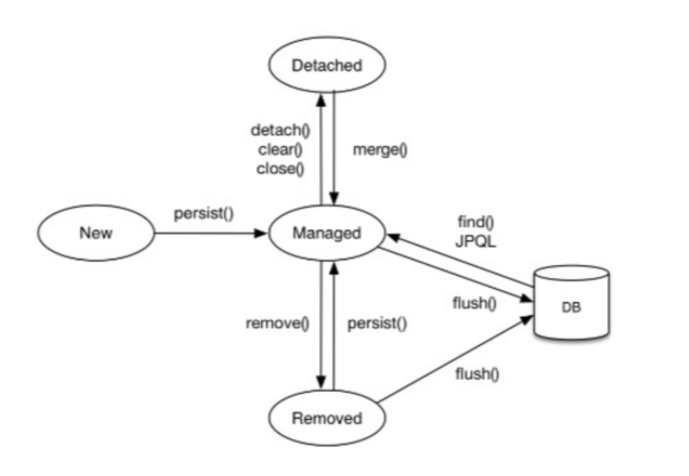

# 1. JPA (Java Persistence API)

- JPA는 자바 진영에서 ORM 기술 표준으로 사용되는 인터페이스의 모음이다.
- 그 말은 즉슨 실제적으로 구현된 것이 아니라 구현된 클래스와 매핑을 해주기 위해 사용되는 프레임워크이다.
- JPA를 구현한 대표적인 오픈소스로는 `Hibernate`가 있다.

> Hibernate
> - JPA의 실제 구현 class를 모아둔 것이 Hibernate이다.
> - JPA라는 ORM 기술 표준을 구현한 것이 Hibernate이므로, JPA를 사용하려면 개발자는 Hibernate를 사용하면 된다.
> - Hibernate에서 자주 사용하는 것들을 Spring boot가 묶어서 보관하는데 그것이 Spring data jpa이다.

### **SQL을 직접 다룰 때 발생하는 문제점**

- 진정한 의미의 계층 분할이 어렵다.
- Entity를 신뢰할 수 없다.
- SQL에 의존적인 개발을 피하기 어렵다.

### **왜 JPA를 사용해야 하는가?**

**생산성**

- JPA를 자바 컬렉션에 **객체를 저장하듯** JPA에게 저장할 객체를 전달.
- INSERT SQL을 작성하고 JDBC API를 사용하는 등 **지루하고 반복적인 일을 JPA가 대신 처리**해 준다.
- CREATE TABLE 같은 **DDL문을 자동으로 생성**해준다.
- DB 설계 중심의 패러다임을 **객체 설계 중심으로 역전**시켜준다.

**유지보수**

- Entity에 필드 추가시 등록, 수정, 조회 관련 코드를 모드 변경해야 하는 것을 JPA가 대신 처리해준다.
- 개발자가 작성해야 할 SQL과 JDBC API 코드를 JPA가 대신 처리해줌으로 유지보수 해야 하는 코드가 줄어든다.

**성능**

- 다양항 성능 최적화 기회 제공
- 어플리케이션과 DB 사이에 존재함으로 여러 최적화 시도 가능

**데이터 접근 추상화와 벤더 독립성**

- DB 기술에 종속되지 않도록 한다.
- DB를 변경하면 JPA에게 다른 DB를 사용한다고 알려주면 된다
    - Dialect (방언)이라고도 한다.

# **2. 영속성 컨텍스트**

- JPA를 이해하는데 가장 중요한 용어
- **엔티티를 영구 저장하는 환경**이라는 뜻
- `EntityManager.persist(entity);`

**영속성 컨텍스트의 생명주기**

- **비영속** (new/transient)
    - 영속성 컨텍스트와 전혀 관계가 없는 새로운 상태
- **영속** (managed)
    - 영속성 컨텍스트에 관리되는 상태
- **준영속** (detached)
    - 영속성 컨텍스트에 저장되었다가 분리된 상태
- **삭제** (removed)
    - 삭제된 상태


### 영속성 컨텍스트의 이점

- `1차 캐시 동일성(identity) 보장`
    - 영속성 컨텍스트 안에 있는 1차 캐시 부터 조회하여 찾는다
- `트랜잭션을 지원하는 쓰기 지연`(transactional write-behind)
    - 영속성 컨텍스트 안의 쓰기 지연 SQL 저장소로 INSERT SQL을 생성해 보낸다
    - 커밋하는 순간 데이터베이스에 INSERT SQL을 보낸다 -> `flush`
- `변경 감지`(Dirty Checking)
    - 1차 캐시의 스냅샷(최초로 영속성 컨텍스트/1차 캐시에 들어온 상태)과 Entity의 변경된 값들을 비교한다그리고 변경된 부분을 DB에 반영한다
    
### 잠깐, 변경 감지?
>변경감지는 **트랜잭션 커밋시** 영속화된 Entity에서 가지고 있었던 **최초 정보(스냅샷)와 바뀐 Entity 정보**를 비교해서 바뀐 부분을 **update 해주는** 기능

위의 내용을 하나하나 살펴보면
- **트랜잭션 커밋시**JPA는 트랜잭션 커밋시 EntityManager에서 flush를 자동 호출해준다. 
    - flush는 영속성 컨텍스트의 변경 내용을 DB에 반영하는 것이라고 생각하면 된다. 
    - 트랜잭션 커밋할 때 DB에 변경 내용을 update하지 않고 커밋하게되면 아무것도 변경되지 않기 때문에 JPA에서 트랜잭션 커밋할 때 이를 자동으로 수행해준다.
- **스냅샷과 바뀐 정보**가 있을시 flush를 호출하게 되면 스냅샷과 Entity의 바뀐 정보를 서로 비교하게 된다.
    - 스냅샷은 DB에서 데이터를 가져와 영속성 컨텍스트에 저장해 Entity를 영속화할 때의 최초 정보들이다.
    - 가져온 Entity 최초 정보를 가지고 로직 중간에 수정한 데이터들과 비교를 하는 것!!
- **update 처리**를 한다.
    - 스냅샷 정보와 Entity 바뀐 정보를 비교해 최초 정보에서 바뀐 부분들을 기준으로 update 쿼리를 작성하게 된다.
    - update 쿼리는 잠시 특정 저장소(쓰기 지연 저장소)에 담겨져있다가 마지막에 한꺼번에 DB로 요청을 보내게 된다. (JPA **쓰기지연** 기능)
---
- `지연 로딩(Lazy Loading)`
    - 예를 들어, Member,Team 연관관계(N:1)에서 실제 team을 **사용하는 시점(get)에 초기화**(DB 조회) 후 프록시로 Team의 정보를 가져온다

### 그래서 플러시(flush)가 뭔데?

플러시란 : 영속성 컨텍스트의 변경된 내용을 DB에 반영한다!!

**플러시의 발생 순서**

- 더티 체킹 (변경 감지)
- 수정된 엔티티를 쓰기 지연 SQL 저장소에 등록
- 쓰기 지연 SQL 저장소의 쿼리를 DB에 전송 (등록,수정,삭제....)

**영속성 컨텍스트를 플러시 하는 방법**

- `em.flush()` - 직접 호출 (잘 사용하진 않는다)
- 트랜잭션 커밋 - 플러시 자동 호출
- JPQL 쿼리 실행 - 플러시 자동 호출
    ```java
    public void 메서드(){
        em.persist(memberA);
        em.persist(memberB);
        em.persist(memberC);

        //중간에 JPQL 실행
        query = em.createQuery("select m from Member m", Member.class);
        List<Member> members= query.getResultList();
    }
    ```
    -  먼저 em.persist()를 호출해서 엔티티 memberA, memberB, memberC를 영속 상태로 만들었다.
    - 이 엔티티들은 영속성 컨텍스트에는 있지만 아직 데이터베이스에는 반영되지 않았다.
    - 이때 JPQL을 실행하면 어떻게 될까? JPQL은 SQL로 변환되어 데이터베이스에서 엔티티를 조회한다. 그런데 memeberA, memberB, memberC는 아직 데이터베이스에 없으므로 쿼리 결과로 조회되지 않는다. 
    - 따라서 쿼리를 실행하기 직전에 영속성 컨텍스트를 플러시해서 변경 내용을 데이터베이스에 반영해야 한다. 
    - JPA는 이런 문제를 예방하기 위해 JPQL을 실행할 때도 플러시를 자동 호출한다. 따라서 memberA, memberB, memberC도 쿼리 결과에 포함된다.
- **참고로 식별자를 기준으로 조회하는 find() 메소드를 호출할 때는 플러시가 실행되지 않는다.**

**플러시는!!**

- 영속성 컨텍스트를 비우지 않음
    - 영속성 컨텍스트 비우고 싶다면 메서드 호출: em.clear()
- 영속성 컨텍스트의 변경내용을 데이터베이스에 동기화
- 트랜잭션이라는 작업 단위가 중요 -> 커밋 직전에만 동기화 하면 됨

### Quiz
아래의 코드에서 `entity`의 영속 상태는 뭘까요? 이유와 함께!
```kotlin
fun updateEntityData(id: Long, changed: String) {
    val entity = memoRepository.findEntityById(id) 
        ?: throw RuntimeException("존재하지 않는 Entity 입니다.")
 
    entity.updateInformation(changed)
}
```