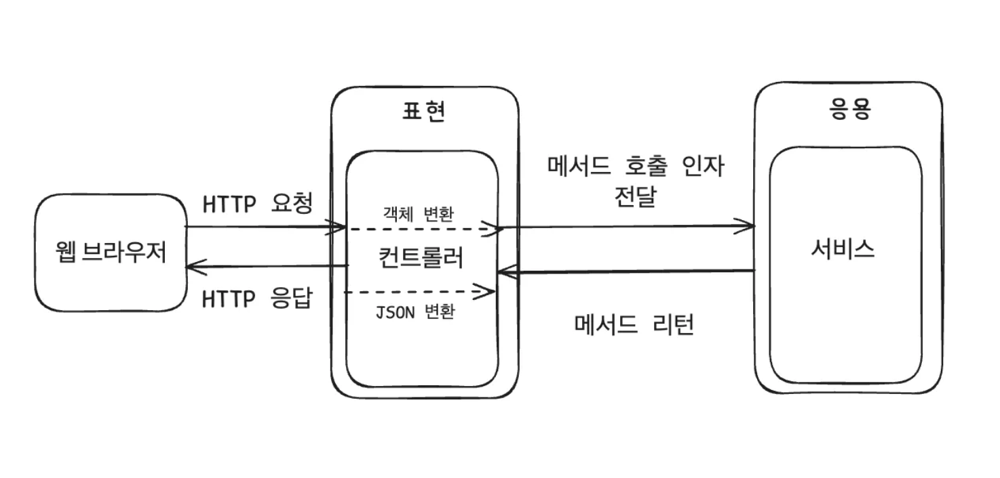

# 학습 목표

적어도 우리 회사 사람들끼리는 DDD에 관한 지식을 통합하자. 싱크를 맞추자! 결국 방법론!

베이스 서적 : [에릭 에반스 : DDD](https://product.kyobobook.co.kr/detail/S000001514402),  [최범균 : 도메인 주도 개발 시작하기](https://product.kyobobook.co.kr/detail/S000001810495)

# 2. DDD 2장 - 아키텍처 개요

- Keywords : `아키텍처`, `DIP`, `도메인 영역의 주요 구성요소`, `인프라스트럭처`, `모듈`

## 1. 네 개의 영역


- 표현 영역
    - HTTP 요청을 응용 영역이 필요로 하는 형식으로 변환해서 전달
    - 응용 영역의 응답을 HTTP 응답으로 변환하여 전송
- 응용 영역
    - 표현 영역을 통해 사용자의 요청을 전달받아 시스템이 사용자에게 제공해야 할 기능을 구현
    - 기능을 구현하기 위해 도메인 영역의 도메인 모델을 사용
    - **로직을 직접 수행하기보다는 도메인 모델에 로직 수행을 위임**
    
    ```java
    public class CancelOrderService {
        @Transactional
        public void cancelOrder(String orderId) {
        	Order order = findOrderById(orderId);
            if (order == null) throw new OrderNotFoundException(orderId);
            order.cancel(); // 도메인 모델에 로직 수행을 위임
        }
        ...
    }
    ```
    
    
- 도메인 영역
    - 도메인 모델을 구현
    - 도메인의 핵심 로직을 구현
- 인프라스트럭처
    - **구현 기술**에 대한것을 다루는 영역
    - RDBMS, SMTP, 서버, 카프카 연동 등 **논리적인 개념을 다루는 것이 아닌 실제 구현을 다룬다.**


도메인 영역, 응용 영역, 표현 영역은 구현 기술을 사용한 코드를 직접 만들지 않는다!<br>
대신 인프라스트럭처 영역에서 제공하는 기능을 사용해서 필요한 기능을 개발한다.

- Email 발송 → SMTP 연동 모듈을 이용해 메일 발송
- DB를 이용한 시스템 개발 → DBMS를 이용한 CRUD
- API 호출 → REST Client 사용을 통한 API 호출

## 2. 계층 구조 아키텍처


- 도메인의 복잡도에 따라 응용과 도메인 영역을 분리하기도, 통합하기도 하지만 전체적인 큰 아키텍처는 위의 계층 구조를 따른다.
- 계층 구조 특성상 상위 계층 → 하위 계층으로의 의존만 존재한다.
- 하위 계층에서 상위 계층을 의존하지는 않는다.

### 계층간 의존 관계

- 위 룰을 엄격하게 적용한다면 상위 계층은 바로 아래의 하위 계층에만 의존을 가져야한다.
- 하지만 구현의 편리함을 위해 계층 구조를 유연하게 적용하기도 한다.


### 문제점

계층 구조 아키텍처의 계층 의존 관계에는 응용 계층과 도메인 계층은 **상세한 구현 기술을 다루는 인프라스트럭처 계층에 종속**된다.<br>
예를 들어 도메인의 가격 계산 규칙이 있다고 하자.<br>
할인 금액을 계산하기 위해 외부의 할인률 계산용 Rule 엔진을 사용해서 계산 로직을 수행하는 인프라스트럭처 영역의 코드가 있다.

**DroolsRuleEngine.java (인프라스트럭처 계층)**

```java
public class DroolsRuleEngine {
	private KieContainer kContainer;
    
    public DroolsRuleEngine() { 
    	KieServices ks = KieServices.Factory.get();
        kContainer = ks.getKieClasspathContainer();
    }
    
    public void evaluate(String sessionName, List<?> facts) {
    	KieSession kSession = kContainer.newKieSession(sessionName);
        try {
        	facts.forEach(x -> kSession.insert(x));
            kSession.fireAllRules();
        } finally {
        	kSession.dispose();
        }
    }
}
```

**CalculateDiscountService.java (응용 계층)**

```java
public class CalculateDiscountService {
	private DroolsRuleEngine ruleEngine;

    public CalculateDiscountService() {
    	ruleEngine = new DroolsRuleEngine();
    }

    public Money calculateDiscount(List<OrderLine> orderLines, String customerId) {
    	Customer customer = findCustomer(customerId);

        MutableMoney money = new MutableMoney(0);
        List<?> facts = Arrays.asList(customer, money);
        facts.addAll(orderLines);
        ruleEngine.evaluate("discountCalculation", facts);
        return money.toImmutableMoney();
    }
}
```

- CalculateDiscountService의 `calculateDiscount` 메소드를 볼 경우 응용 계층에서 인프라스트럭처 계층의 DroolsRuleEngine을 이용하기 위해 일부 로직을 구현한 것을 볼 수 있다.
- 이것만으로 의존하지 않는다고 생각할 수 있지만, `discountCalculation`는 DroolsRuleEngine의 session 이름을 의미하며 session 이름이 변경될 경우 응용 계층의 코드 또한 변경해야 하는 **간접 의존이 발생**한다.